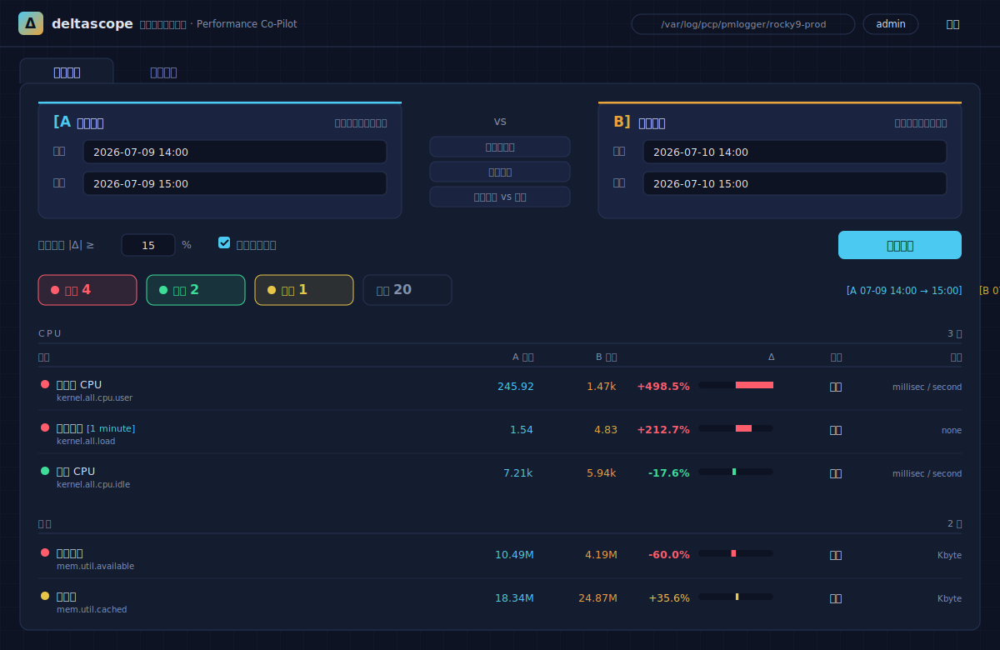
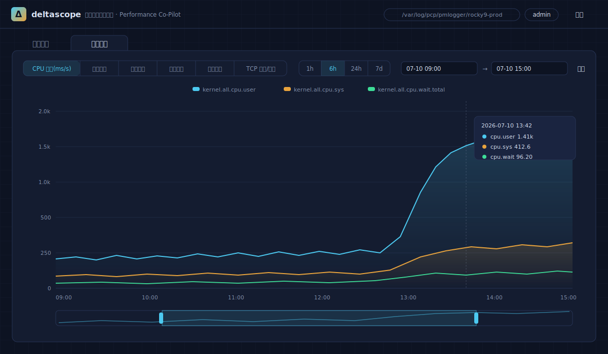
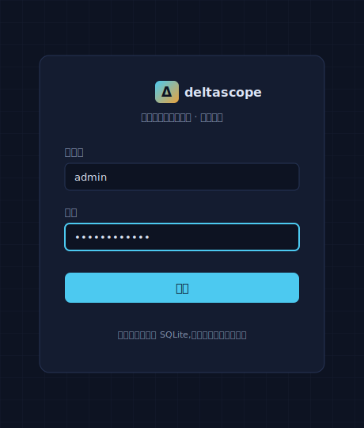
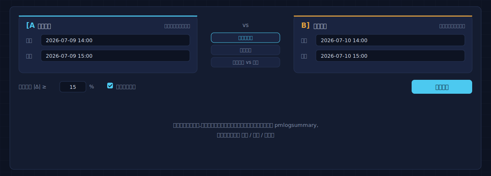
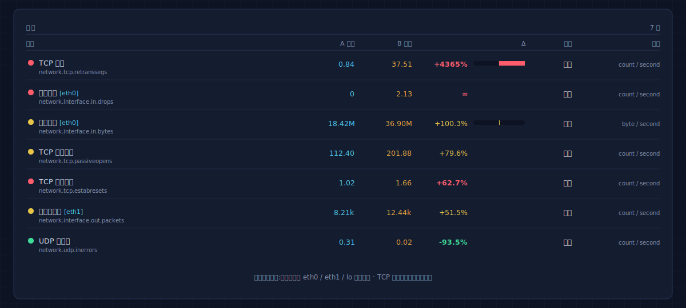
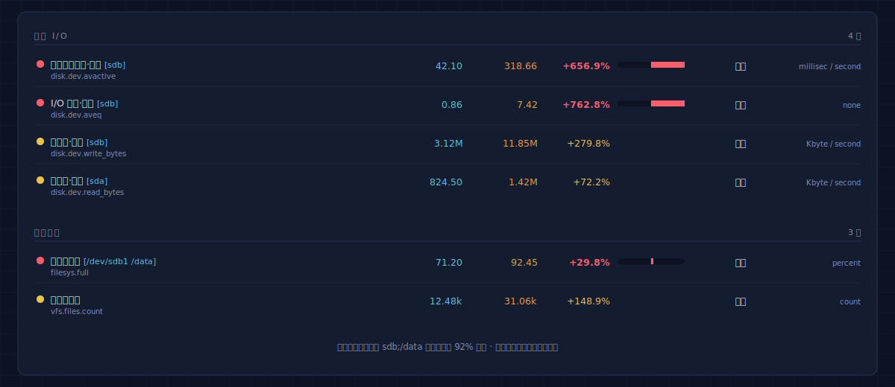
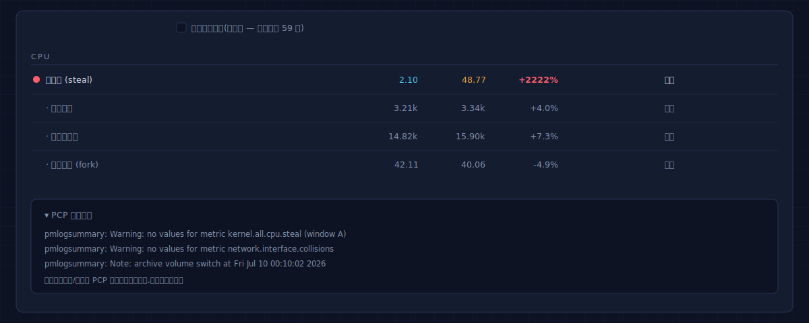
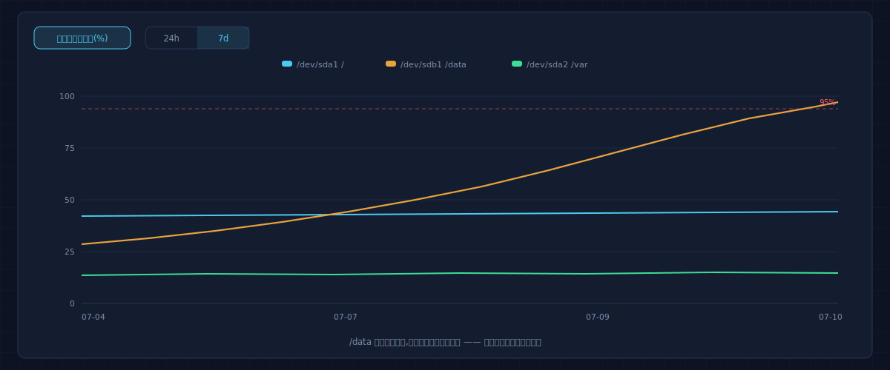
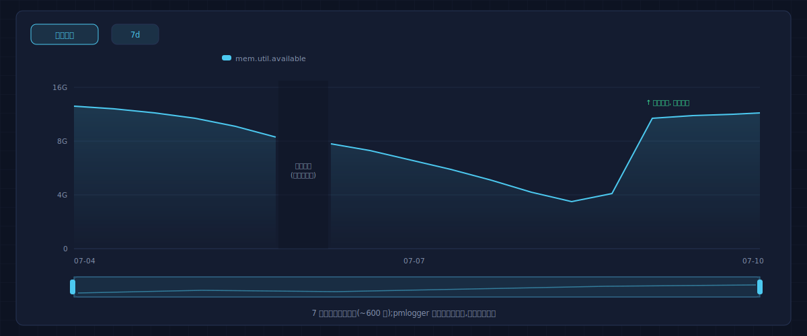
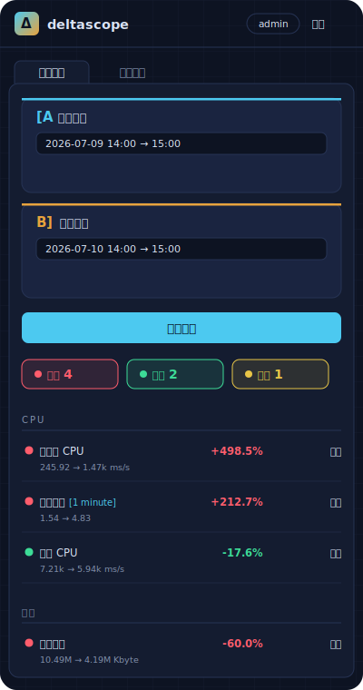

<div align="center">


# deltascope

**单机性能倒退示波台 · Performance regression scope for a single Linux box · 単一ホスト性能リグレッション観測台**

[](https://go.dev)
[](https://pcp.io)
[]()
[]()
[](LICENSE)

[中文](#-中文) · [English](#-english) · [日本語](#-日本語)


</div>

---

```
Browser ──HTTP(S)── deltascope (Go, one static binary)
                      ├─ exec pmlogsummary   ← A/B window regression diff
                      ├─ exec pmrep -o csv   ← history trend sampling
                      ├─ SQLite              ← local credentials (pure-Go, no CGO)
                      └─ embed.FS            ← HTML/CSS/JS/ECharts, all embedded
PCP side: pmcd + pmlogger record archives, pmlogger_daily -k N ring-style cleanup
```

<div align="center">


<sub>倒退比对报告 · A/B regression report · リグレッション比較レポート</sub>

<br><br>


<sub>历史趋势 · History trends · 履歴トレンド</sub>

</div>

<details>
<summary><b>更多界面 · More views · その他の画面 (8)</b></summary>
<br>
<table>
<tr>
<td width="50%"><br><sub align="center">登录 · Login · ログイン</sub></td>
<td width="50%"><br><sub>窗口选择与快捷预设 · Window presets · プリセット</sub></td>
</tr>
<tr>
<td><br><sub>网络分类·分网卡 · Per-NIC rows · NIC 別行</sub></td>
<td><br><sub>磁盘分盘与文件系统 · Per-device & filesystem · デバイス別</sub></td>
</tr>
<tr>
<td><br><sub>全量视图与 PCP 告警框 · Full view & warnings · 全量表示</sub></td>
<td><br><sub>文件系统使用率趋势 · Filesystem trend · FS 使用率</sub></td>
</tr>
<tr>
<td><br><sub>7 天窗口与断线呈现 · 7-day window & gaps · 7日間表示</sub></td>
<td><br><sub>移动端 · Mobile · モバイル</sub></td>
</tr>
</table>

<sub><i>以上为按实际样式绘制的 UI preview;部署后可替换为真实截图 · Faithful UI previews, replace with real screenshots after deployment · 実際のスタイルに基づく UI プレビュー</i></sub>
</details>

---

##  中文

选定两个时间窗口——**基线 A** 与 **对比 B**——deltascope 对 PCP(Performance
Co-Pilot)归档各执行一次 `pmlogsummary`,按指标极性生成性能体检报告:
🔴 恶化 / 🟢 改善 / 🟡 关注,并提供带缩放的 ECharts 历史趋势图。

**形态:一个静态二进制 + 一个 SQLite 文件。** 前端(含 ECharts)全部内嵌,
无 CDN、无外部服务、无运行时依赖,专为**不能访问外网的隔离环境**设计。

### 构建(联网开发机,一次性)

```bash
make vendor   # go mod tidy && go mod vendor, 固化依赖后离线可重复构建
make test
make build    # CGO_ENABLED=0 静态编译, 产物 ./deltascope (~15MB)
```

### 部署(目标机 Rocky Linux 9,可完全离线)

```bash
# 离线机需预下载 PCP RPM: 在同版本联网 Rocky 9 上
#   dnf download --resolve --alldeps pcp pcp-system-tools
# 将 rpm 放入部署目录 rpms/ 子目录
scp deltascope deploy.sh root@target:/opt/deltascope/
RETENTION_DAYS=7 LISTEN_ADDR=0.0.0.0:8080 \
DSCOPE_ADMIN_USER=admin DSCOPE_ADMIN_PASS='一个强密码' ./deploy.sh
```

deploy.sh:安装/校验 PCP → 启用 pmcd/pmlogger → 配置 `pmlogger_daily -k N`
环形清理(默认 7 天)→ 专用系统用户(入 `pcp` 组读归档)→ 创建管理员 →
加固的 systemd 服务 → 可选放行 firewalld。

### 判定语义

- counter 指标由 `pmlogsummary` 自动换算**速率均值**(与 pmdiff 一致)
- Δ% = (B − A) / |A| × 100,`|Δ| ≥ 阈值`(默认 15%,可调)才参与判定
- 极性:`worse_up`(CPU、重传,升=恶化)/ `better_up`(可用内存,升=改善)/
  `neutral`(吞吐量,显著变化仅标 🟡 关注)
- A=0 → B≠0 记 ∞ 按方向判定;单侧无数据标 🟡
- 内置 **146 项指标 · 5 大分类**,含 PSI 压力、软中断丢包、每核热点(自动聚合折叠)、
  TCP 连接状态分布、直接回收/内存规整、LVM/MD 设备等深水区信号;分盘分卡独立成行
- **诊断规则引擎(医生意见)**:16 条内置跨指标经验规则(换页螺旋、磁盘饱和、
  accept 队列溢出、OOM、单核热点、SYN 压力…),命中即在报告顶部输出一句结论 +
  依据 + 下一步排查命令;规则与指标目录一样可 `export` 后自定义并经 `-rules` 加载
- 报告默认全量渲染:平稳行灰显作背景,指标位置固定,行底色深浅 ∝ |Δ|,
  新出现 ⊕ / 消失 ⊖ 独立标记,Top 5 恶化锚点直达;`profiles/` 提供 full/core 两档目录

### 安全设计

| 面 | 措施 |
|---|---|
| 口令存储 | PBKDF2-HMAC-SHA256,600k 迭代,16B 随机盐(Go 1.24+ 标准库) |
| 会话 | HMAC-SHA256 签名 Cookie,HttpOnly + SameSite=Strict,默认 12h |
| 暴力破解 | 按 IP 限速:15 分钟 10 次失败锁定;用户不存在也执行哈希拉平时间侧信道 |
| 命令注入 | 指标名白名单;时间参数经 Go `time` 解析后重格式化;exec 数组传参不过 shell |
| 浏览器侧 | CSP `default-src 'self'`(零内联),nosniff,DENY frame |
| systemd | 非特权用户 + ProtectSystem=strict + NoNewPrivileges |

---

## English

Pick two time windows — **baseline A** vs **suspect B** — and deltascope runs
`pmlogsummary` against the PCP (Performance Co-Pilot) archives once per window,
then renders a polarity-aware health report: 🔴 regressed / 🟢 improved /
🟡 watch, plus zoomable ECharts history trends.

**Shape: one static binary + one SQLite file.** The entire frontend (ECharts
included) is embedded via `embed.FS` — no CDN, no external services, no runtime
dependencies. Built for **air-gapped hosts** from day one.

### Build (internet-connected dev box, once)

```bash
make vendor   # go mod tidy && go mod vendor — reproducible offline builds after this
make test
make build    # CGO_ENABLED=0 static build → ./deltascope (~15MB)
```

### Deploy (target: Rocky Linux 9, fully offline OK)

```bash
# For offline hosts, pre-download PCP RPMs on a matching online Rocky 9:
#   dnf download --resolve --alldeps pcp pcp-system-tools
# and drop them into ./rpms/ next to deploy.sh
scp deltascope deploy.sh root@target:/opt/deltascope/
RETENTION_DAYS=7 LISTEN_ADDR=0.0.0.0:8080 \
DSCOPE_ADMIN_USER=admin DSCOPE_ADMIN_PASS='a-strong-one' ./deploy.sh
```

The script installs/validates PCP, enables pmcd/pmlogger, configures ring-style
archive retention (`pmlogger_daily -k N`, default 7 days), creates a dedicated
system user (in group `pcp` for archive read access), seeds the admin account,
and installs a hardened systemd unit.

### Diff semantics

- Counters are averaged **as rates** by `pmlogsummary` (same semantics as pmdiff)
- Δ% = (B − A) / |A| × 100; only `|Δ| ≥ threshold` (default 15%) is judged
- Polarity: `worse_up` (CPU, TCP retrans — up is bad), `better_up`
  (available memory — up is good), `neutral` (throughput — flagged 🟡 only)
- A=0 → B≠0 is reported as ∞ and judged by direction; one-sided gaps get 🟡
- **146 built-in metrics across 5 categories**, incl. PSI pressure, softnet drops,
  per-core hotspots (auto-folded), TCP connection-state distribution, direct reclaim,
  LVM/MD devices; per-device and per-NIC instance rows
- **Diagnosis rule engine ("doctor's notes")**: 16 built-in cross-metric rules (swap
  spiral, disk saturation, accept-queue overflow, OOM, single-core hotspot, SYN
  pressure…) — each hit renders a plain-language conclusion + evidence + next commands
  at the top of the report; rules are exportable and swappable via `-rules`
- Full-data report by default: flat rows dimmed in place, stable row order, row tint
  scales with |Δ|, appeared ⊕ / vanished ⊖ marked distinctly, Top-5 anchors; see
  `profiles/` for full/core catalog tiers

### Security

PBKDF2-HMAC-SHA256 (600k iters, per-user salt, Go stdlib) · HMAC-signed
stateless session cookies (HttpOnly, SameSite=Strict) · per-IP login rate
limiting with timing-sidechannel-flattened lookups · metric-name whitelisting +
array-form exec (no shell, ever) · strict CSP `default-src 'self'` with zero
inline script/style · hardened systemd unit (non-root, ProtectSystem=strict).

---

## 日本語

**ベースライン A** と **比較対象 B** の 2 つの時間帯を選ぶと、deltascope が
PCP(Performance Co-Pilot)アーカイブに対して各ウィンドウで `pmlogsummary`
を実行し、メトリクスの極性を考慮した健康診断レポートを生成します:
🔴 悪化 / 🟢 改善 / 🟡 要観察。ズーム可能な ECharts トレンドグラフ付き。

**構成:静的バイナリ 1 つ + SQLite ファイル 1 つ。** フロントエンド
(ECharts 含む)はすべて `embed.FS` で内蔵。CDN なし、外部サービスなし、
ランタイム依存なし。**外部ネットワークに接続できない隔離環境**のための設計です。

### ビルド(ネット接続のある開発機で一度だけ)

```bash
make vendor   # go mod tidy && go mod vendor — 以降はオフラインで再現ビルド可能
make test
make build    # CGO_ENABLED=0 静的ビルド → ./deltascope (~15MB)
```

### デプロイ(対象:Rocky Linux 9、完全オフライン可)

```bash
# オフライン機の場合、同一バージョンのオンライン Rocky 9 で事前に
#   dnf download --resolve --alldeps pcp pcp-system-tools
# を実行し、rpm を deploy.sh と同じ場所の ./rpms/ に配置
scp deltascope deploy.sh root@target:/opt/deltascope/
RETENTION_DAYS=7 LISTEN_ADDR=0.0.0.0:8080 \
DSCOPE_ADMIN_USER=admin DSCOPE_ADMIN_PASS='強いパスワード' ./deploy.sh
```

スクリプトは PCP の導入/検証、pmcd/pmlogger の有効化、リングバッファ式の
アーカイブ保持設定(`pmlogger_daily -k N`、既定 7 日)、専用システムユーザー
の作成(アーカイブ読取のため `pcp` グループへ参加)、管理者アカウントの投入、
強化済み systemd ユニットの設置までを一括で行います。

### 判定ロジック

- カウンタ系メトリクスは `pmlogsummary` が**レート平均**へ自動換算(pmdiff と同一の意味論)
- Δ% = (B − A) / |A| × 100。`|Δ| ≥ しきい値`(既定 15%、変更可)のみ判定対象
- 極性:`worse_up`(CPU・TCP 再送 — 上昇=悪化)/ `better_up`(空きメモリ —
  上昇=改善)/ `neutral`(スループット — 変化は 🟡 のみ)
- A=0 → B≠0 は ∞ として方向で判定。片側欠損は 🟡
- **146 メトリクス・5 カテゴリ**を内蔵。PSI、softnet ドロップ、コア別ホットスポット
  (自動折りたたみ)、TCP 状態分布、直接回収、LVM/MD デバイス等の深層シグナルを含む
- **診断ルールエンジン(医師の所見)**:16 の組み込みクロスメトリクスルール(スワップ
  スパイラル、ディスク飽和、accept キュー溢れ、OOM、SYN 圧力…)。命中すると結論 +
  根拠 + 次の調査コマンドをレポート上部に表示。`-rules` で差し替え可能
- レポートは全量表示が既定:変化なし行は灰色で保持、行位置固定、行の濃淡は |Δ| に
  比例、新規 ⊕ / 消失 ⊖ を区別表示、Top-5 アンカー付き。`profiles/` に full/core 二档

### セキュリティ

PBKDF2-HMAC-SHA256(600k 回、ユーザー毎ソルト、Go 標準ライブラリ)·
HMAC 署名のステートレスセッション Cookie(HttpOnly、SameSite=Strict)·
IP 単位のログイン試行制限(タイミングサイドチャネル平準化付き)·
メトリクス名ホワイトリスト + 配列形式 exec(シェル不経由)·
厳格 CSP `default-src 'self'`(インライン一切なし)· 強化 systemd ユニット。

---

<div align="center">

**Notes** · Windows are interpreted in the server's local timezone · max window
32 days · exec timeout 30s · trend step auto-adapts (10s–15m, ~600 points) ·
ECharts is vendored under Apache-2.0 (`web/static/echarts.min.js`).

`Δ` — *because regressions should be visible on the first sweep.*

</div>
